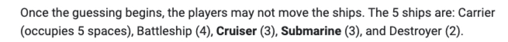
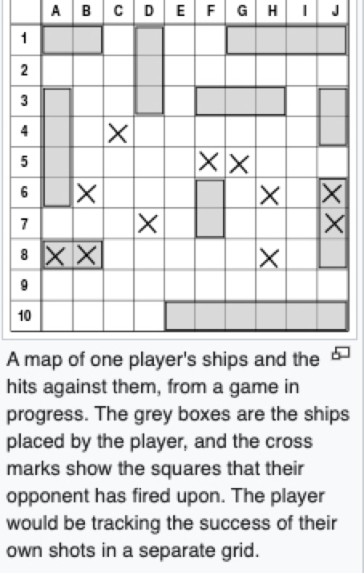

# Terminal Battle_Ship Sim
---
## Overview
---
- Organized by 3 Main objects
   ---
    * Player
        * Player Name
        * Player Ship Board
        * Player Attack Board
        * Bot Ship Board
        * Bot Attack Board (Used to store what it's hit so it doesn't attempt to hit it again)
    ---
    * Game
        * Start Game & Gather Player information
        * Initialize loop to keep player in game until completion
        * Prompt player to re-play
            - If yes, restart the game.
            - If no, end program.
    ---
    * Board
        * Object that instantiates a board to the specifications provided in the list parameter that is fed to it
    ---    
- Rules
    ---
    * 
    * 
    
---

    